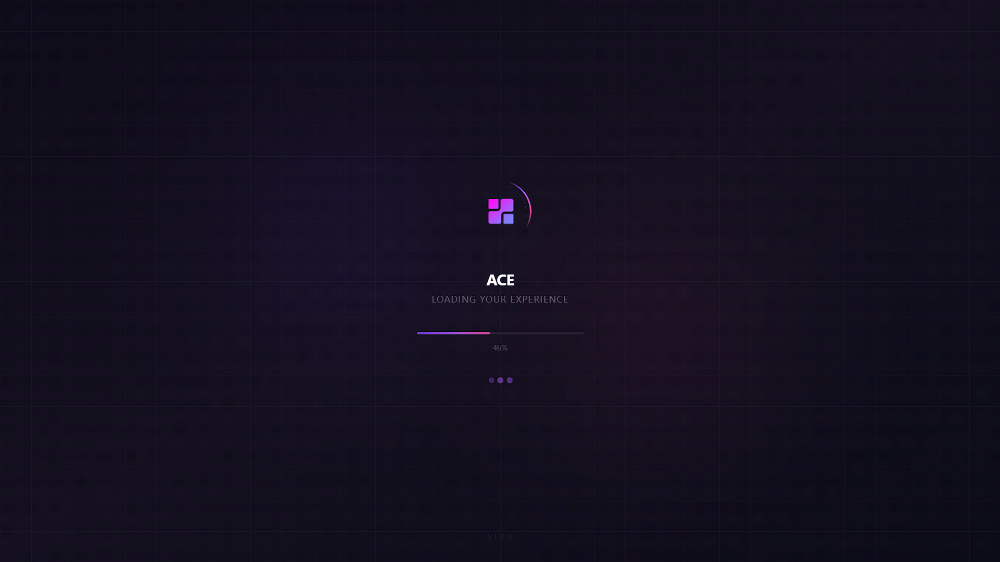
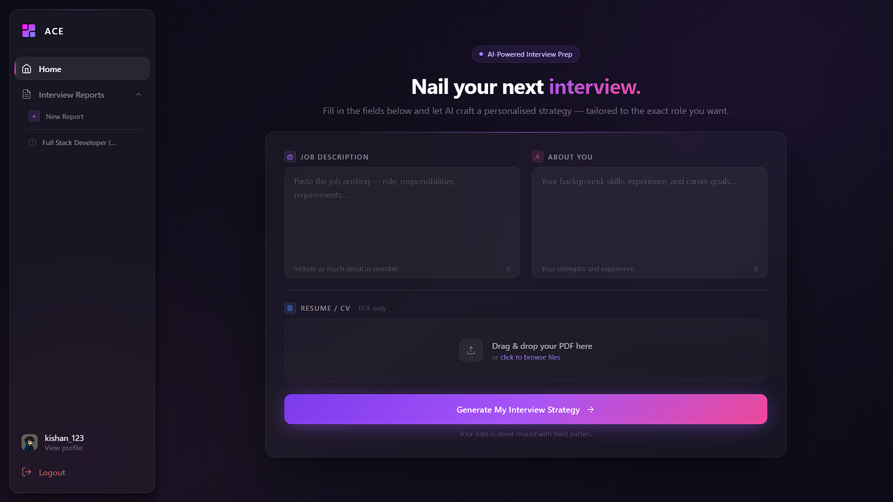
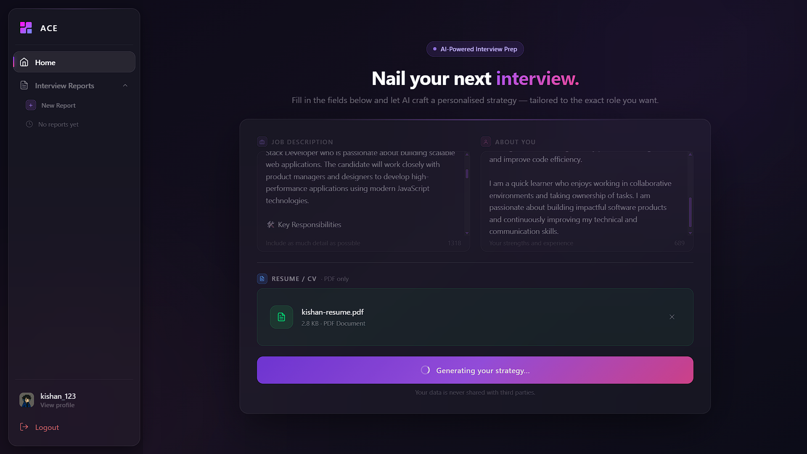
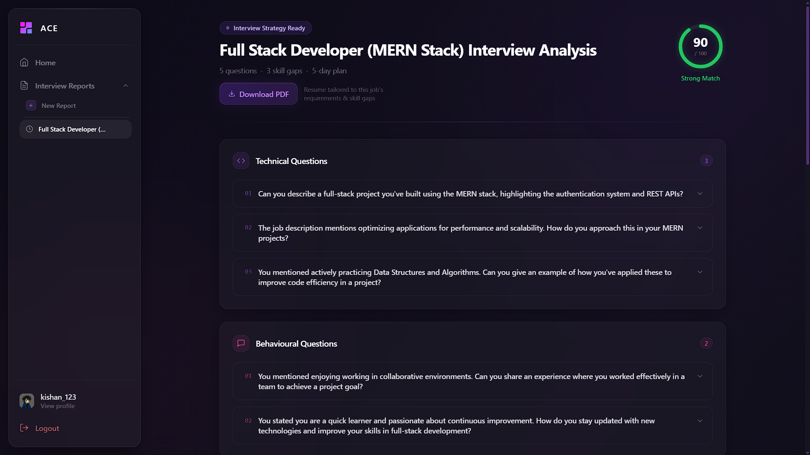
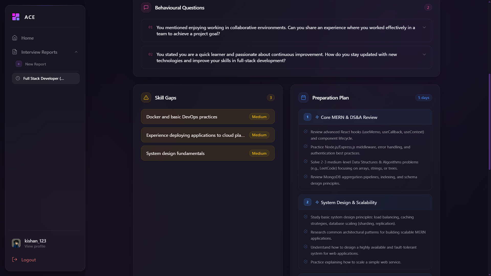
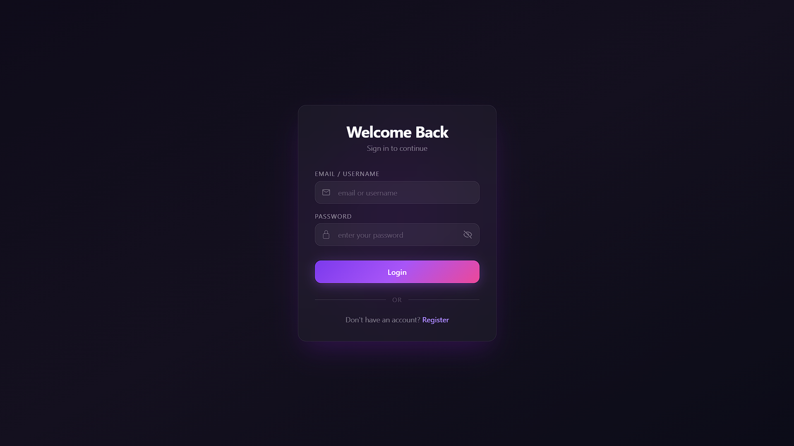
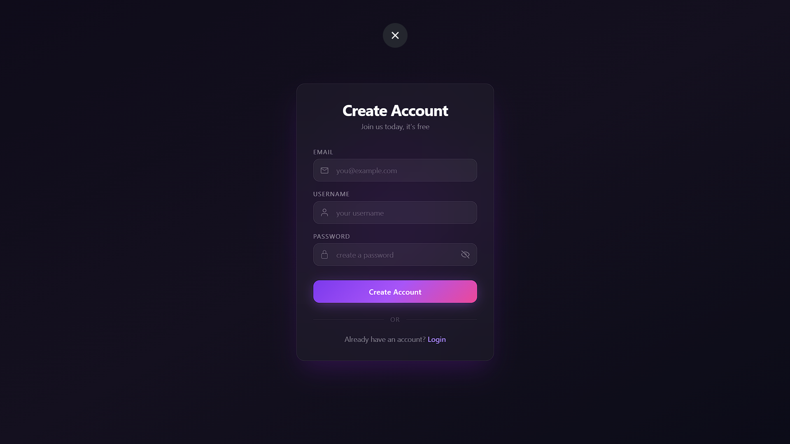
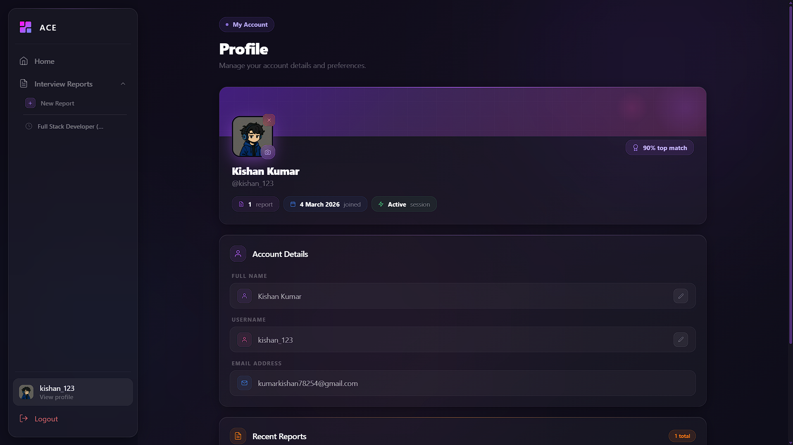
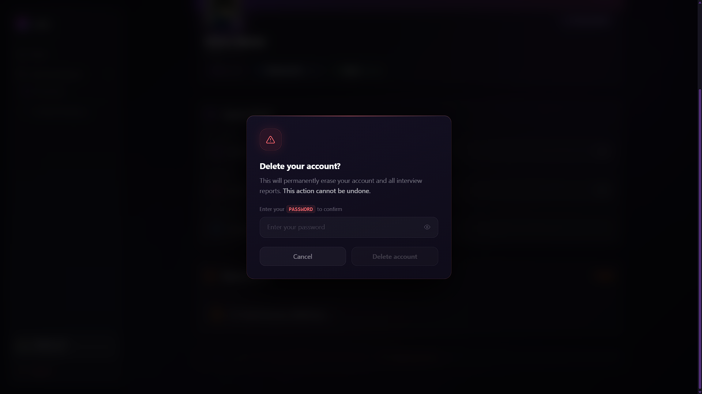

# 🎯 Job Preparation Web App

> **Ace Your Interviews with AI-Powered Analysis** — An intelligent platform that analyzes your resume against job descriptions and generates personalized interview insights, questions, and comprehensive feedback.

<div align="center">

[](https://reactjs.org/)
[](https://nodejs.org/)
[](https://www.mongodb.com/)
[](https://tailwindcss.com/)
[](https://ai.google.dev/)

</div>

---

## 📋 Table of Contents

- [🌟 Features](#-features)
- [📸 Screenshots](#-screenshots)
- [🛠️ Tech Stack](#️-tech-stack)
- [📁 Project Structure](#-project-structure)
- [🚀 Quick Start](#-quick-start)
- [📖 Usage Guide](#-usage-guide)
- [🔌 API Endpoints](#-api-endpoints)
- [🤝 Contributing](#-contributing)
- [👤 Author](#-author)

---

## 🌟 Features

### 🎓 Smart Resume Analysis
- Upload your resume (PDF format) and get instant AI-powered analysis
- Intelligent matching against job descriptions
- Detailed compatibility scoring with visual feedback

### 🤖 AI-Powered Interview Questions
- Generate customized interview questions based on your profile and job description
- Expertly crafted follow-up questions for deeper preparation
- Questions tailored to your experience level and target role

### 📄 AI-Generated Tailored Resume
- Automatically generates a resume optimized for the target job description
- Highlights relevant skills and experience based on the role requirements
- Download as a print-ready PDF in one click

### 📊 Comprehensive Interview Reports
- Detailed analysis of strengths and weaknesses
- Skill gap identification with severity ratings
- Personalized day-by-day preparation strategies

### 👤 User Authentication & Profiles
- Secure login and registration system
- Profile management with avatar upload
- Interview history tracking
- Save and revisit previous reports

### 📱 Responsive Design
- Seamless experience on desktop and mobile devices
- Smooth animations and intuitive UI
- Dark-themed interface for comfortable viewing

### 🔐 Security First
- JWT-based authentication with refresh tokens
- Password encryption with bcryptjs
- Secure file uploads and handling
- CORS protection

---

## 📸 Screenshots

<div align="center">

### Splash Screen & Loading


### Home Page — Resume Upload & Analysis



### Interview Report — AI-Generated Questions



### User Management




### Account Management


</div>

---

## 🛠️ Tech Stack

### Frontend
| Technology | Version | Purpose |
|---|---|---|
| React | 19.2 | UI library |
| Vite | 7.3 | Build tool |
| Redux Toolkit | 2.11 | State management |
| Tailwind CSS | 4.2 | Styling |
| Framer Motion | latest | Animations |
| React Router | v7 | Client-side routing |
| Axios | latest | HTTP client |
| React Toastify | latest | Toast notifications |

### Backend
| Technology | Version | Purpose |
|---|---|---|
| Node.js + Express | 5.2 | Server framework |
| MongoDB | 9.2 | Database |
| Mongoose | latest | ODM |
| Google GenAI | latest | AI analysis |
| JWT | latest | Authentication |
| bcryptjs | latest | Password hashing |
| Multer | latest | File uploads |
| ImageKit | latest | Image storage |
| Puppeteer | latest | PDF generation |
| pdf-parse | latest | PDF extraction |

---

## 📁 Project Structure

```
Job-Preparation-Web-App/
├── client/                          # Frontend Application
│   ├── src/
│   │   ├── components/              # Reusable React components
│   │   │   ├── DeleteModal.jsx
│   │   │   ├── DesktopSidebar.jsx
│   │   │   ├── EditableField.jsx
│   │   │   ├── Loader.jsx
│   │   │   ├── MobileNav.jsx
│   │   │   ├── Navbar.jsx
│   │   │   ├── QuestionCard.jsx
│   │   │   ├── SectionCard.jsx
│   │   │   ├── SectionHeader.jsx
│   │   │   └── SplashScreen.jsx
│   │   ├── pages/                   # Page components
│   │   │   ├── Home.jsx
│   │   │   ├── Interview.jsx
│   │   │   ├── Login.jsx
│   │   │   ├── Register.jsx
│   │   │   ├── Profile.jsx
│   │   │   └── NotFound.jsx
│   │   ├── routes/                  # Route configurations
│   │   │   ├── BrowserRouter.jsx
│   │   │   ├── ProtectedRoute.jsx
│   │   │   └── PublicRoute.jsx
│   │   ├── store/                   # Redux state management
│   │   │   ├── store.js
│   │   │   └── features/
│   │   ├── axios/                   # API configuration
│   │   ├── layout/                  # Layout components
│   │   ├── App.jsx
│   │   └── main.jsx
│   ├── vite.config.js
│   ├── tailwind.config.js
│   └── package.json
│
├── server/                          # Backend Application
│   ├── src/
│   │   ├── config/
│   │   │   ├── db.js
│   │   │   ├── server.config.js
│   │   │   └── index.js
│   │   ├── controllers/
│   │   │   ├── auth.controller.js
│   │   │   ├── interview.controller.js
│   │   │   └── userProfile.controller.js
│   │   ├── models/
│   │   │   ├── user.model.js
│   │   │   ├── interviewReport.model.js
│   │   │   ├── blacklist.model.js
│   │   │   └── index.js
│   │   ├── routes/
│   │   │   ├── v1/
│   │   │   │   ├── auth.route.js
│   │   │   │   ├── interview.route.js
│   │   │   │   └── userProfile.route.js
│   │   │   └── index.js
│   │   ├── middlewares/
│   │   │   ├── auth.middleware.js
│   │   │   ├── errorHandler.middleware.js
│   │   │   └── file.middleware.js
│   │   ├── services/
│   │   │   ├── ai.service.js
│   │   │   └── imagekit.service.js
│   │   └── index.js
│   ├── .env
│   └── package.json
│
└── screenshots/
```

---

## 🚀 Quick Start

### Prerequisites
- **Node.js** v16 or higher
- **npm** or **yarn**
- **MongoDB** (local or Atlas cloud instance)
- **Google GenAI API Key** — [Get one here](https://ai.google.dev/)
- **ImageKit Account** — [Sign up here](https://imagekit.io/)

### Installation

#### 1. Clone the Repository
```bash
git clone https://github.com/Kishan-code/Job-Preparation-Web-App.git
cd Job-Preparation-Web-App
```

#### 2. Setup Backend
```bash
cd server
npm install
```

Create a `.env` file in the `server/` directory:

```env
PORT=5000
MONGODB_URI=your_mongodb_connection_string
JWT_SECRET=your_jwt_secret
GOOGLE_GENAI_API_KEY=your_google_genai_key
IMAGEKIT_PUBLIC_KEY=your_imagekit_public_key
IMAGEKIT_PRIVATE_KEY=your_imagekit_private_key
IMAGEKIT_URL_ENDPOINT=your_imagekit_url_endpoint
CLIENT_URL=http://localhost:5173
```

```bash
npm run dev
```

#### 3. Setup Frontend
```bash
cd ../client
npm install
npm run dev
```

Visit **http://localhost:5173** to access the app.

---

## 📖 Usage Guide

### Step 1 — Create an Account
Navigate to the **Register** page, fill in your details, and click **Sign Up**.

### Step 2 — Upload Your Resume
On the **Home** page, upload your resume as a PDF, add a brief self-description covering your skills and experience, then paste in the job description you're targeting.

### Step 3 — Generate Analysis
Click **Analyze** and wait for the AI to process your information. The report is usually ready in a few seconds.

### Step 4 — Review Your Report
The generated report includes:
- **Overall Compatibility Score** with visual ring indicator
- **Technical & Behavioural Interview Questions** tailored to the role
- **Skill Gap Analysis** ranked by severity (High / Medium / Low)
- **Day-by-Day Preparation Plan** with focused tasks
- **Personalized Recommendations** based on your profile

### Step 5 — Generate & Download Your Tailored Resume
Click **Download PDF** to generate a resume that is automatically tailored to the target job's requirements and skill gaps. The AI rewrites and optimizes your resume content based on the job description so you can submit a focused, role-specific application alongside your interview preparation.


---

## 🤝 Contributing

Contributions are welcome!

1. Fork the repository
2. Create a feature branch — `git checkout -b feature/YourFeature`
3. Commit your changes — `git commit -m 'Add YourFeature'`
4. Push to your fork — `git push origin feature/YourFeature`
5. Open a Pull Request with a clear description of your changes

### Code Style
- Follow the **Airbnb JavaScript Style Guide**
- Use meaningful variable and function names
- Keep functions small and focused
- Add comments for complex logic

---

## 👤 Author

**Kishan Kumar** — Full Stack Developer

- 📧 Email: [kumarkishan78254@gmail.com](mailto:kumarkishan78254@gmail.com)
- 🐙 GitHub: [@Kishan-code](https://github.com/Kishan-code)
- 💼 LinkedIn: [Kishan Kumar](https://www.linkedin.com/in/kishan-kumar-6772a2338/)

---

## 🙏 Acknowledgments

- [Google GenAI](https://ai.google.dev/) for powerful AI text analysis
- [ImageKit](https://imagekit.io/) for efficient image storage and optimization
- [MongoDB](https://www.mongodb.com/) for a reliable, flexible database
- The [React](https://reactjs.org/) and [Vite](https://vitejs.dev/) communities for amazing tooling

---

<div align="center">

### ⭐ If you found this helpful, please consider giving it a star!

**Made with ❤️ by [Kishan Kumar](https://github.com/Kishan-code)**

</div>
# ACE-AI-based-Job-preparation-web-app-

